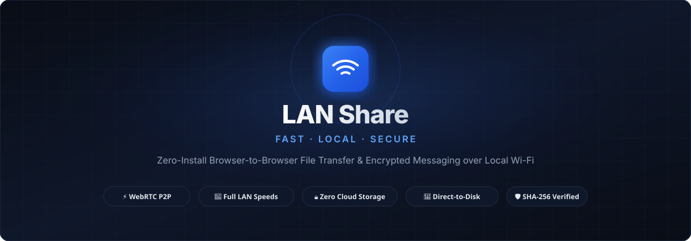
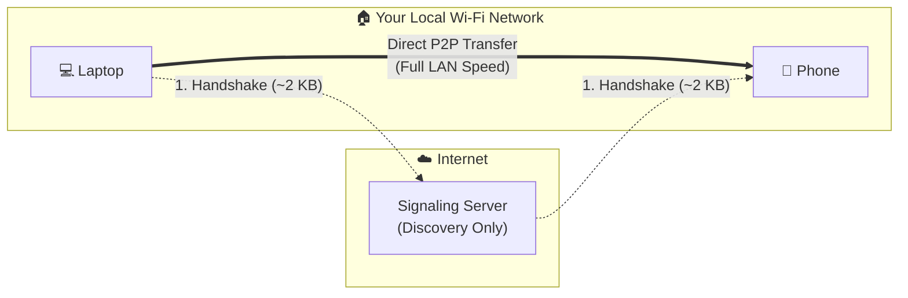
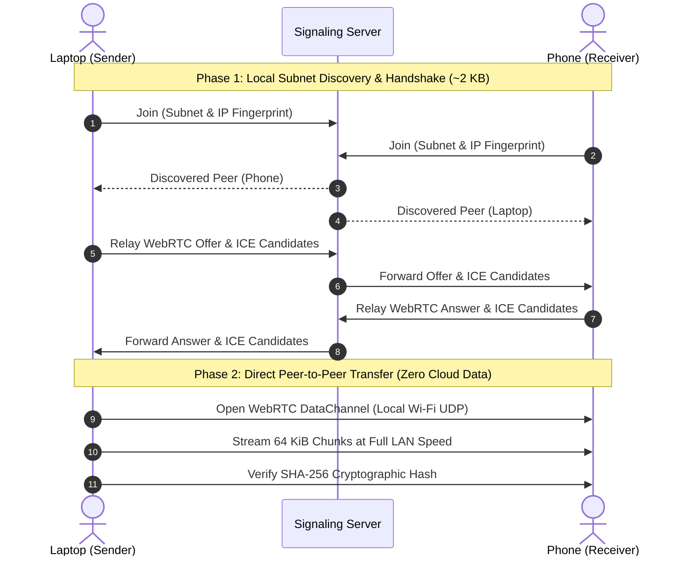

<div align="center">

# 📡 LAN Share

**Zero-install, browser-to-browser peer-to-peer file transfer & chat over your local network.**

No cloud uploads. No account sign-ups. No arbitrary file size limits.

[](LICENSE)
[](docs/QA-CHECKLIST.md)
[](https://react.dev/)
[](https://vitejs.dev/)
[](https://webrtc.org/)
[](https://socket.io/)
[](https://github.com/bilalzulfiqar-pk/lan-share/pulls)

<br />


<!-- Tip: Your previous coded vector banner is also preserved at `docs/assets/banner_coded.svg` -->

<!-- 
  📸 SCREENSHOT / DEMO PLACEHOLDER:
  To display an authentic screenshot or animated GIF of your application:
  1. Save your capture as `docs/assets/preview.png` (or `.gif`).
  2. Uncomment the line below:
  <p align="center"></p>
-->

</div>

---

## Table of Contents

- [Key Features](#key-features)
- [How It Works](#how-it-works)
- [Tech Stack](#tech-stack)
- [Getting Started](#getting-started)
- [Browser Support](#browser-support)
- [Network Troubleshooting](#network-troubleshooting)
- [Deployment](#deployment)
- [Testing & Quality Assurance](#testing--quality-assurance)
- [Project Structure](#project-structure)
- [Documentation](#documentation)
- [License](#license)

---

## Key Features

- **Direct LAN Speeds:** Transfers flow directly peer-to-peer via WebRTC DataChannels (~30–80+ MB/s depending on your local router), bypassing internet bandwidth caps.
- **Zero Installation:** Runs entirely inside modern desktop and mobile browsers — no native drivers, root permissions, or app store downloads required.
- **Direct-to-Disk Streaming (Chromium):** Uses the native File System Access API (`showSaveFilePicker`) to stream multi-gigabyte transfers directly to storage with minimal RAM usage.
- **Cryptographic Verification:** End-to-end streaming SHA-256 chunk validation ensures 100% bit-for-bit file integrity upon completion.
- **Real-Time Radar Discovery:** Devices on the same Wi-Fi or subnet appear automatically on an animated radar screen without manual IP entry or pairing PINs.
- **Encrypted P2P Chat:** Ephemeral text messaging with link parsing, monospace formatting, and one-tap copy-to-clipboard.
- **Instant QR Pairing:** Display a QR code in the header so smartphones on the same Wi-Fi can join the radar in seconds.
- **Adaptive Theming & PWA:** 8 theme variants (Ocean, Forest, Rose, Neon across light and dark modes) with standalone Progressive Web App install support.
- **Reconnection Resilience:** Ongoing file transfers survive temporary signaling server disconnections without aborting.

---

## How It Works

LAN Share separates the **discovery handshake** from the **actual file payload**:



1. **Signaling & Clustering:** When a device opens the app, it connects to a tiny Socket.IO signaling server. The server derives local subnet and STUN fingerprints, placing the device into an in-memory inverted index (`SimilarityIndex`) so only devices on the same physical network can discover each other.
2. **Handshake Relay:** When you select a peer, the signaling server relays ~2 KB of WebRTC session descriptions (SDP offer/answer and ICE candidates).
3. **Direct Data Streaming:** The two browsers establish a direct, DTLS-encrypted WebRTC `RTCDataChannel`. All file chunks and chat messages stream directly across your local Wi-Fi. **Your files never touch any cloud server.**

<details>
<summary><b>View detailed WebRTC handshake sequence</b></summary>



</details>

---

## Tech Stack

- **Frontend:** [React 19](https://react.dev/), [Vite](https://vitejs.dev/), WebRTC DataChannels, Streams API, Lucide Icons
- **Signaling Server:** [Node.js](https://nodejs.org/), [Express](https://expressjs.com/), [Socket.IO](https://socket.io/), custom $O(M^2)$ `SimilarityIndex`
- **Testing:** [Vitest](https://vitest.dev/) (Unit test suites + live child-process server integration tests)
- **Code Quality:** ESLint with React Hooks rules

---

## Getting Started

### Prerequisites
* [Node.js](https://nodejs.org/) (v18 or higher recommended)
* `npm` or your preferred package manager

### 1. Clone the repository
```bash
git clone https://github.com/bilalzulfiqar-pk/lan-share.git
cd lan-share
```

### 2. Start the signaling server
```bash
cd server
npm install
npm run dev
# Server listens on http://localhost:3001
```

### 3. Start the client (in a new terminal)
```bash
cd client
npm install
npm run dev
# Vite starts with --host and prints your local LAN IP (e.g., http://192.168.1.100:5173)
```

### 4. Open on your devices
Open the printed local network URL on any two devices connected to the same Wi-Fi. They will immediately show up on each other's radar!

---

## Browser Support

| Capability | Chrome / Edge (Desktop) | Safari (macOS / iOS) | Firefox | Android Chrome |
| :--- | :---: | :---: | :---: | :---: |
| **Radar Discovery & Chat** | ✓ Full | ✓ Full | ✓ Full | ✓ Full |
| **File Transfer** | ✓ Direct-to-Disk (Multi-GB) | Limited (2 GB in-memory) | Limited (2 GB in-memory) | Limited (2 GB in-memory) |
| **Integrity Verification (SHA-256)** | ✓ Verified | ✓ Verified | ✓ Verified | ✓ Verified |
| **PWA Installation** | ✓ Supported | ✓ Add to Home Screen | Limited | ✓ Supported |

> **Note on Large Files:** Desktop Chromium browsers stream files directly to disk via `window.showSaveFilePicker`. Mobile browsers and Firefox assemble chunks in memory, which is ideal for photos, videos, and documents up to ~2 GB.

---

## Network Troubleshooting

### Router AP / Client Isolation
On strict public Wi-Fi networks (hotels, airports, universities, dorms), routers often have **Client Isolation** enabled. This prevents devices on the same Wi-Fi from talking directly to each other via UDP.

* **How LAN Share handles this:** If a connection attempt does not complete within 20 seconds, the client detects the timeout and displays a helpful troubleshooting banner:
  > *"Device did not respond. If you are on hotel, university, or public Wi-Fi, the router may have Client Isolation enabled."*
* **Solution:** Use a private home Wi-Fi network, a mobile hotspot, or configure a TURN relay in your environment variables.

---

## Deployment

### Client (Static Hosting — Vercel / Netlify / Cloudflare Pages)
* **Root Directory:** `client/`
* **Build Command:** `npm run build`
* **Output Directory:** `dist/`
* **Environment Variable:** Set `VITE_SERVER_URL` to your deployed signaling server URL.

### Signaling Server (Render / Railway / Fly.io / VPS)
* **Root Directory:** `server/`
* **Build Command:** `npm install`
* **Start Command:** `npm start`
* **Health Check Endpoint:** `GET /health` (returns `{"ok": true}`)

### Client Environment Variables

| Variable | Required | Description |
| :--- | :---: | :--- |
| `VITE_SERVER_URL` | Optional | URL of your deployed signaling server. If omitted, defaults to port `3001` on the same hostname (ideal for local development). |
| `VITE_TURN_URL` | Optional | Comma-separated TURN server URLs for networks where direct P2P is blocked by strict NAT or AP isolation. |
| `VITE_TURN_USERNAME` | Optional | Username for the TURN server. |
| `VITE_TURN_CREDENTIAL` | Optional | Credential / password for the TURN server. |

---

## Testing & Quality Assurance

The codebase includes 50 automated unit and integration tests across both the client and server:

```bash
# Run signaling server tests (similarity index, rate limiter, sanitization)
npm test --prefix server

# Run client tests (chunking protocol, transfer engine, child-process server integration)
npm test --prefix client

# Run client linter
npm run lint --prefix client
```

For pre-release or physical multi-device verification, refer to the comprehensive [Manual QA Checklist](docs/QA-CHECKLIST.md).

---

## Project Structure

```
lan-share/
├── client/                     # React 19 + Vite frontend
│   ├── public/                 # Favicons, Web App Manifest, audio blips
│   └── src/
│       ├── components/         # Radar canvas, chat panel, history panel, QR modal
│       ├── hooks/              # useSignaling (Socket.IO), useWebRTC (transfer engine)
│       └── lib/                # TransferEngine, wire protocol, notifications, crypto
│           └── __tests__/      # Vitest suites (mock WebRTC + live server integration)
├── server/                     # Express + Socket.IO signaling service
│   ├── index.js                # Server entry point, connection events, rate limiter
│   ├── lib.js                  # SimilarityIndex inverted index, IP/subnet clustering
│   └── lib.test.js             # Vitest test suite for server clustering logic
├── docs/                       # Project documentation
│   ├── assets/                 # Architecture diagrams and UI preview assets
│   ├── CHANGELOG.md            # Detailed history of changes and milestones
│   ├── QA-CHECKLIST.md         # Multi-device pre-release QA checklist
│   └── POSSIBLE-ENHANCEMENTS.md# Conceptual future explorations (OPFS, companion mode)
└── README.md                   # Repository overview
```

---

## Documentation

* [Changelog](docs/CHANGELOG.md) — Complete log of features, optimizations, and bug fixes.
* [Manual QA Checklist](docs/QA-CHECKLIST.md) — Comprehensive checklist for cross-device testing.
* [Possible Future Enhancements](docs/POSSIBLE-ENHANCEMENTS.md) — Conceptual explorations for OPFS mobile streaming, offline companion modes, and TURN setups.

---

## License

This project is open-source and free to use. See [LICENSE](LICENSE) for details.
