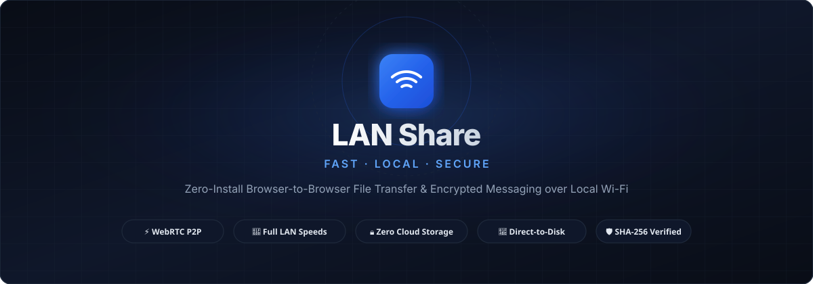
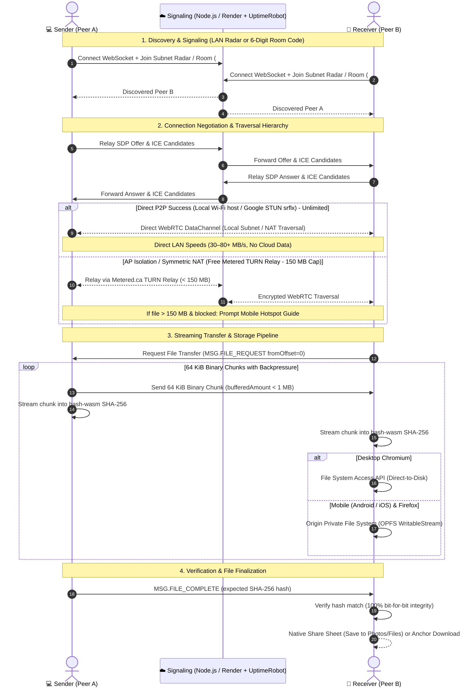

<div align="center">

# 📡 LAN Share

**Direct browser-to-browser P2P file transfer and chat on local Wi-Fi, powered by WebRTC with no cloud storage, mobile multi-GB OPFS streaming, and zero-corrupt WebAssembly SHA-256 verification.**

[](LICENSE)
[](https://lan-share.vercel.app/)
[](docs/QA-CHECKLIST.md)
[](https://react.dev/)
[](https://vitejs.dev/)
[](https://webrtc.org/)
[](https://developer.mozilla.org/en-US/docs/Web/API/File_System_API/Origin_private_file_system)
[](https://github.com/Daninet/hash-wasm)
[](docker-compose.yml)
[](https://github.com/bilalzulfiqar-pk/lan-share/pulls)

<br />



</div>

---

## Table of Contents

- [Key Features](#key-features)
- [Connection Lifecycle & Architecture](#connection-lifecycle--architecture)
- [Network Resilience & Difficult Wi-Fi Handling](#network-resilience--difficult-wi-fi-handling)
  - [Understanding Access Point (AP) Isolation](#understanding-access-point-ap-isolation)
  - [University & Enterprise VLAN Segmentation](#university--enterprise-vlan-segmentation)
  - [6-Digit Room Codes & Shareable URL Hashes](#6-digit-room-codes--shareable-url-hashes)
  - [Metered.ca Ephemeral TURN Relay (150 MB Cap)](#meteredca-ephemeral-turn-relay-150-mb-cap)
  - [The Mobile Hotspot Hack (Full 50+ MB/s Speed)](#the-mobile-hotspot-hack-full-50-mbs-speed)
- [Quickstart (3 Commands)](#quickstart-3-commands)
  - [Option A: Local Development (npm)](#option-a-local-development-npm)
  - [Option B: Docker Compose](#option-b-docker-compose)
- [Browser & Storage Engine Compatibility](#browser--storage-engine-compatibility)
- [Mobile & Browser Notifications](#mobile--browser-notifications)
- [Tech Stack](#tech-stack)
- [Deployment](#deployment)
- [Testing & Quality Assurance](#testing--quality-assurance)
- [Project Structure](#project-structure)
- [Documentation](#documentation)
- [License](#license)

---

## Key Features

- **Direct LAN Speeds:** Transfers stream peer-to-peer over WebRTC DataChannels at native Wi-Fi speeds (~30–80+ MB/s depending on router hardware), bypassing internet bandwidth limits.
- **Zero Cloud Storage & Zero Install:** Runs entirely inside any modern web browser. No desktop software, browser extensions, mobile apps, or cloud accounts required.
- **Mobile Multi-GB OPFS Streaming:** Eliminates the notorious mobile browser 2 GB in-memory RAM crash by streaming incoming chunks directly to the **Origin Private File System (OPFS)** via `FileSystemWritableFileStream`.
- **Desktop Direct-to-Disk:** Streams directly to disk on Chromium desktop browsers using the native **File System Access API** (`showSaveFilePicker`).
- **WebAssembly SHA-256 Verification:** Verifies 100% bit-for-bit file integrity on-the-fly using hardware-accelerated streaming WebAssembly (`hash-wasm`).
- **Dual Discovery Modes:**
  - **Subnet Radar:** Devices on the same local Wi-Fi automatically discover each other in real-time.
  - **6-Digit Room Codes & QR Codes:** Instant pairing across segmented VLANs, 2.4/5 GHz bands, or guest networks via URL hashes (e.g., `#room=492810`) and camera scans.
- **Screen Wake Lock & Background Audio Beacon:** Prevents mobile devices (iOS Safari & Android Chrome) from putting tabs to sleep mid-transfer using `navigator.wakeLock` and an inaudible audio beacon loop.
- **Backpressure Flow Control:** Dynamically throttles chunk transmissions when the underlying WebRTC buffer fills up (`bufferedAmount < 1 MB`), preventing buffer overflows and packet loss.
- **Resilient Reconnections:** Automatic ICE renegotiation and chunk-offset resumption recover ongoing transfers during momentary Wi-Fi blips.
- **Encrypted Ephemeral P2P Chat:** In-session messaging with auto-link parsing, code block styling, and one-tap copy.

---

## Connection Lifecycle & Architecture

LAN Share strictly isolates signaling discovery from actual file payloads. File data **never touches any intermediate cloud server**.


```mermaid
sequenceDiagram
    autonumber
    actor A as 💻 Sender (Peer A)
    participant S as ☁️ Signaling (Node.js / Render + UptimeRobot)
    actor B as 📱 Receiver (Peer B)

    Note over A,B: 1. Discovery & Signaling (LAN Radar or 6-Digit Room Code)
    A->>S: Connect WebSocket + Join Subnet Radar / Room (#room=xyz)
    B->>S: Connect WebSocket + Join Subnet Radar / Room (#room=xyz)
    S-->>A: Discovered Peer B
    S-->>B: Discovered Peer A

    Note over A,B: 2. Connection Negotiation & Traversal Hierarchy
    A->>S: Relay SDP Offer & ICE Candidates
    S->>B: Forward Offer & ICE Candidates
    B->>S: Relay SDP Answer & ICE Candidates
    S->>A: Forward Answer & ICE Candidates

    alt Direct P2P Success (Local Wi-Fi host / Google STUN srflx) - Unlimited
        A<<-->>B: Direct WebRTC DataChannel (Local Subnet / NAT Traversal)
        Note over A,B: Direct LAN Speeds (30–80+ MB/s, No Cloud Data)
    else AP Isolation / Symmetric NAT (Free Metered TURN Relay - 150 MB Cap)
        A<<-->>S: Relay via Metered.ca TURN Relay (< 150 MB)
        S<<-->>B: Encrypted WebRTC Traversal
        Note over A,B: If file > 150 MB & blocked: Prompt Mobile Hotspot Guide
    end

    Note over A,B: 3. Streaming Transfer & Storage Pipeline
    B->>A: Request File Transfer (MSG.FILE_REQUEST fromOffset=0)
    loop 64 KiB Binary Chunks with Backpressure
        A->>B: Send 64 KiB Binary Chunk (bufferedAmount < 1 MB)
        A->>A: Stream chunk into hash-wasm SHA-256
        B->>B: Stream chunk into hash-wasm SHA-256
        alt Desktop Chromium
            B->>B: File System Access API (Direct-to-Disk)
        else Mobile (Android / iOS) & Firefox
            B->>B: Origin Private File System (OPFS WritableStream)
        end
    end

    Note over A,B: 4. Verification & File Finalization
    A->>B: MSG.FILE_COMPLETE (expected SHA-256 hash)
    B->>B: Verify hash match (100% bit-for-bit integrity)
    B-->>B: Native Share Sheet (Save to Photos/Files) or Anchor Download
```

### Connection Stages Breakdown

1. **Signaling Server (Kept Warm 24/7):**
   Hosted on Render and kept continuously awake via an external ping monitor (UptimeRobot). It only brokers small (~2 KB) SDP offers, answers, and ICE candidates over WebSockets.
2. **Subnet Radar vs. Room Pairing:**
   Peers on simple home routers auto-cluster by public IP and subnet fingerprints (`SimilarityIndex`). When subnets are split, entering a 6-digit room code or opening `#room=123456` groups peers regardless of network topology.
3. **P2P Establishment:**
   WebRTC probes host (direct LAN), server-reflexive (STUN), and relay (TURN) candidates. Direct LAN UDP is prioritized for maximum local throughput.
4. **Chunked Streaming Engine:**
   Files are sliced into 64 KiB ArrayBuffers. If `bufferedAmount` exceeds 1 MB, sender transmission pauses until the `onbufferedamountlow` event fires, preventing memory bloat.
5. **Storage Sinks (Desktop vs. Mobile):**
   - **Chromium Desktop:** Chunks write immediately to disk through `FileSystemFileHandle.createWritable()`.
   - **Mobile (Safari & Android Chrome):** Chunks write incrementally into the Origin Private File System (`navigator.storage.getDirectory()`), capping RAM consumption below 15 MB even for 5+ GB files.
6. **Bit-for-Bit Hash Verification:**
   Sender and receiver calculate SHA-256 digests incrementally in WebAssembly. The file is only committed if the hashes match down to the exact bit.

---

## Network Resilience & Difficult Wi-Fi Handling

Peer-to-peer browser applications face significant real-world challenges on institutional and public networks. LAN Share is engineered specifically to diagnose and resolve these limitations honestly and transparently.

### Understanding Access Point (AP) Isolation

On public Wi-Fi networks (hotels, airports, cafes, and conference centers), network administrators intentionally enable **Access Point (AP) Isolation** (also called Client Isolation or Station-to-Station traffic blocking).

* **The Problem:** AP isolation allows wireless devices to speak to the default gateway (the Internet), but drops all frames sent directly between two wireless clients on the same BSSID/SSID.
* **How It Manifests:** Both devices can reach the web and signaling server, but WebRTC direct LAN host candidates fail to complete the DTLS handshake.

### University & Enterprise VLAN Segmentation

Campuses (such as `eduroam` or corporate environments) often segregate users across distinct subnets, VLANs, or wireless frequency bands:
* A laptop on `10.104.12.x` cannot broadcast or multicast to a smartphone on `10.104.14.x`.
* Multicast DNS (mDNS) and local broadcast discovery packets are filtered by enterprise switches.

### 6-Digit Room Codes & Shareable URL Hashes

To solve cross-subnet and cross-VLAN segregation without requiring server-side IP tracking:
1. One peer clicks **"Create Room"** to generate a randomized 6-digit room code (or custom alphanumeric string).
2. The second peer types the 6-digit code or scans the displayed QR code.
3. The URL updates with a hash anchor: `https://lan-share.vercel.app/#room=492810`.
4. The signaling server clusters the sockets into that explicit room, enabling peers across different subnets, VLANs, or cellular data to exchange WebRTC session descriptions seamlessly.

### Metered.ca Ephemeral TURN Relay (150 MB Cap)

When AP isolation or symmetric NAT completely blocks direct peer-to-peer UDP traffic, LAN Share automatically fetches ephemeral TURN credentials from **Metered.ca OpenRelay**.
* **Safety Quota Protection:** To preserve the free community relay bandwidth and protect user privacy, relayed transfers are strictly capped at **150 MB**.
* **Strict Local Mode:** Users can toggle "Strict Local Mode" in settings to disable TURN relays completely, guaranteeing that no file data ever leaves the local subnet.

### The Mobile Hotspot Hack (Full 50+ MB/s Speed)

When transferring large files (> 150 MB) on a network with strict AP Isolation or complex campus firewalls, LAN Share opens an interactive **Mobile Hotspot Guide Modal**:

```
┌─────────────────────────────────────────────────────────────┐
│ 📱 Wi-Fi Direct Blocked by Router Security (AP Isolation)   │
│                                                             │
│ 1. Turn on "Personal Hotspot" on your smartphone.           │
│ 2. Connect your laptop / receiver to that hotspot Wi-Fi.    │
│ 3. Reload LAN Share — transfer at 50+ MB/s with ZERO        │
│    mobile cellular data consumption!                        │
└─────────────────────────────────────────────────────────────┘
```

**Why this works:** The smartphone's hotspot functions as an open local Wi-Fi router without AP isolation. Traffic between the laptop and the phone routes entirely over the local wireless radio at maximum 802.11ac/ax speeds without consuming cellular mobile data.

---

## Quickstart (3 Commands)

### Option A: Local Development (npm)

Clone and run both services locally in 3 terminal steps:

```bash
# 1. Clone the repository
git clone https://github.com/bilalzulfiqar-pk/lan-share.git && cd lan-share

# 2. Start the signaling server (Terminal 1)
npm install --prefix server && npm run dev --prefix server

# 3. Start the client (Terminal 2)
npm install --prefix client && npm run dev --prefix client
```
Open `http://localhost:5173` on your computer and the printed network IP on your phone!

---

### Option B: Docker Compose

Run the complete stack with Docker Compose in 3 commands:

```bash
# 1. Clone the repository
git clone https://github.com/bilalzulfiqar-pk/lan-share.git && cd lan-share

# 2. Build and launch containers
docker compose up --build

# 3. Open the app
open http://localhost:5173
```

---

## Browser & Storage Engine Compatibility

LAN Share dynamically selects the best storage sink supported by the user's browser environment:

| Feature / Engine | Chrome / Edge (Desktop) | Safari (iOS & macOS) | Android Chrome | Firefox |
| :--- | :---: | :---: | :---: | :---: |
| **Subnet Radar Discovery** | ✅ Full | ✅ Full | ✅ Full | ✅ Full |
| **6-Digit Room & QR Pairing** | ✅ Full | ✅ Full | ✅ Full | ✅ Full |
| **Storage Sink Strategy** | **File System Access API**<br/>(Direct-to-Disk) | **OPFS WritableStream**<br/>(Origin Private File System) | **OPFS WritableStream**<br/>(Origin Private File System) | **OPFS WritableStream**<br/>(Origin Private File System) |
| **Multi-GB Transfers** | ✅ Unlimited | ✅ Multi-GB (No RAM crashes) | ✅ Multi-GB (No RAM crashes) | ✅ Multi-GB |
| **Streaming SHA-256 (Wasm)** | ✅ Hardware accelerated | ✅ Hardware accelerated | ✅ Hardware accelerated | ✅ Hardware accelerated |
| **Screen Wake Lock** | ✅ Supported | ✅ Supported | ✅ Supported | ⚠️ Fallback audio beacon |
| **Native Share Sheet** | ❌ (Direct file save) | ✅ "Save to Photos / Files" | ✅ "Save to Downloads" | ❌ (Direct file save) |
| **PWA Installation** | ✅ Supported | ✅ Add to Home Screen | ✅ Supported | ⚠️ Limited |
| **Smart Hybrid Alerts** | ✅ Native OS Banners | ✅ Sound Chime (PWA Banner) | ✅ Service Worker Banners | ✅ Native OS Banners |

---

## Mobile & Browser Notifications

LAN Share includes a unified alert system controlled by the bell icon in the top header. When toggled off, the app remains 100% silent (no chimes, blips, or popups). When enabled, alerts adapt intelligently to the user's platform:

- **Foreground (Screen Active):** Subtle two-tone Web Audio blips for incoming chat messages and offers, plus a 4-note ascending chord when file transfers finish. Visual popup cards are suppressed while looking at the active screen to avoid interface clutter.
- **Android Phones & Tablets (Chrome / Edge / Samsung Internet):** When minimized or running in a background tab on `https://lan-share.vercel.app/`, notifications are dispatched via `ServiceWorkerRegistration.showNotification()`. Tapping the notification in Android's notification shade instantly focuses the active transfer session.
- **Desktop (Windows, macOS, Linux):** Native OS notifications appear in Windows Action Center or macOS Notification Center when transfers settle while the browser is minimized.
- **iOS & iPadOS (Safari):** Standard Safari browser tabs disable the Web Notification API, so LAN Share automatically enters **Sound Alert Mode** to notify you audibly. If installed to your Home Screen as a PWA (iOS 16.4+), native web push notification banners are supported.
- **Screen Wake Lock Safeguard:** During active file transfers, LAN Share holds a `navigator.wakeLock` to prevent mobile devices from sleeping or pausing Wi-Fi transfers prematurely.

---

## Tech Stack

- **Client:**
  - **Framework:** [React 19](https://react.dev/), [Vite 7](https://vitejs.dev/)
  - **Networking:** Native WebRTC (`RTCDataChannel`), [Socket.IO Client](https://socket.io/)
  - **Storage:** File System Access API, Origin Private File System (OPFS)
  - **Cryptography:** [`hash-wasm`](https://github.com/Daninet/hash-wasm) streaming SHA-256 WebAssembly
  - **Styling & Motion:** Tailwind CSS, Framer Motion, Lucide Icons
- **Signaling Service:**
  - **Runtime:** [Node.js 20+](https://nodejs.org/), [Express](https://expressjs.com/), [Socket.IO 4](https://socket.io/)
  - **Clustering:** Inverted index (`SimilarityIndex`) for subnet clustering + Room namespaces
  - **Relay Provider:** [Metered.ca OpenRelay](https://www.metered.ca/) REST API integration
- **Testing & Quality:**
  - **Test Runner:** [Vitest](https://vitest.dev/) (265 automated unit, integration, and child-process tests)
  - **Linter:** ESLint with React Hooks & Refresh rules

---

## Deployment

### Client (Vercel / Netlify / Cloudflare Pages)
* **Root Directory:** `client/`
* **Build Command:** `npm run build`
* **Output Directory:** `dist/`
* **Environment Variable:** Set `VITE_SERVER_URL` to your signaling server address.

### Signaling Server (Render / Railway / Fly.io / VPS)
* **Root Directory:** `server/`
* **Build Command:** `npm install`
* **Start Command:** `npm start`
* **Health Check Endpoint:** `GET /health` returns `{"ok": true}`.

### Environment Variables

| Variable | Scope | Required | Description |
| :--- | :---: | :---: | :--- |
| `PORT` | Server | Optional | Port for the signaling service (default: `3001`). |
| `METERED_API_KEY` | Server | Optional | Metered.ca REST API key for caching ephemeral TURN credentials. |
| `VITE_SERVER_URL` | Client | Optional | Signaling server URL (default: `http://localhost:3001` or relative origin). |
| `VITE_SITE_URL` | Client | Optional | Canonical site URL for SEO meta and QR sharing (default: `https://lan-share.vercel.app`). |

---

## Testing & Quality Assurance

LAN Share is backed by **265 automated tests** verifying socket clustering, WebRTC state machines, OPFS streaming fallbacks, TURN relay protection, and protocol serialization:

```bash
# Run server test suite (clustering, rooms, TURN credential caching)
npm test --prefix server

# Run client test suite (transfer engine, resumption, OPFS, wakeLock, protocols)
npm test --prefix client

# Run client code linter
npm run lint --prefix client
```

For manual multi-device verification (pairing, audio cues, screen wake lock), see the [Manual QA Checklist](docs/QA-CHECKLIST.md).

---

## Project Structure

```
lan-share/
├── client/                     # React 19 + Vite frontend
│   ├── public/                 # Manifest, favicons, audio cues
│   └── src/
│       ├── components/         # Radar, Chat, RoomModal, HotspotGuideModal
│       ├── hooks/              # useSignaling (Socket.IO), useWebRTC (engine hook)
│       └── lib/                # TransferEngine, protocol, opfs, crypto, wakeLock
│           └── __tests__/      # Vitest client suites (OPFS, resumption, relay)
├── server/                     # Node.js + Express + Socket.IO signaling service
│   ├── index.js                # Server entry point, TURN endpoint, socket events
│   ├── lib.js                  # Subnet clustering, room registry, SimilarityIndex
│   └── *.test.js               # Vitest server suites (rooms, TURN, similarity)
├── docs/                       # Project documentation & guides
│   ├── assets/                 # Vector banner & architecture diagrams
│   ├── QA-CHECKLIST.md         # Multi-device QA checklist
│   └── CHANGELOG.md            # Detailed milestone and release notes
├── docker-compose.yml          # Containerized local development stack
└── README.md                   # Repository overview
```

---

## Documentation

* [Manual QA Checklist](docs/QA-CHECKLIST.md) — Step-by-step physical device testing procedures.
* [Changelog](docs/CHANGELOG.md) — Comprehensive log of features, optimizations, and bug fixes.

---

## License

This project is licensed under the [MIT License](LICENSE). Contributions, bug reports, and pull requests are welcome!
